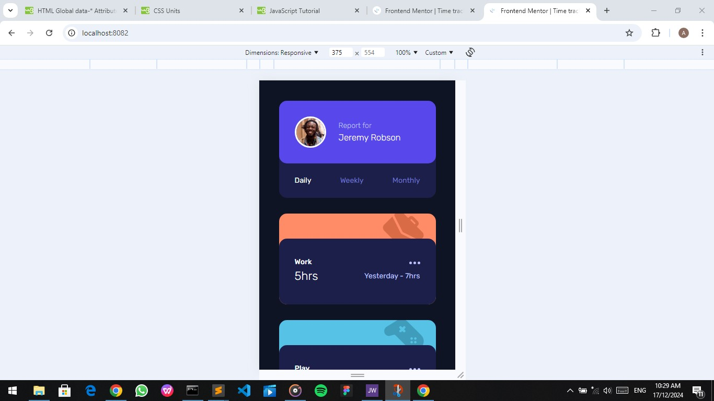
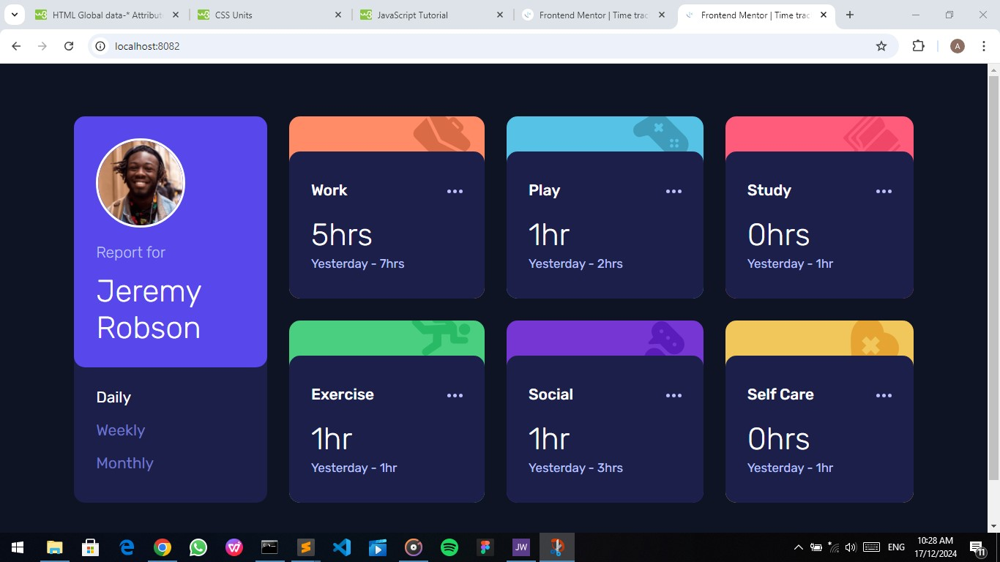

# Frontend Mentor - Time tracking dashboard solution

This is a solution to the [Time tracking dashboard challenge on Frontend Mentor](https://www.frontendmentor.io/challenges/time-tracking-dashboard-UIQ7167Jw).

## Table of contents

- [Overview](#overview)
  - [The challenge](#the-challenge)
  - [Screenshot](#screenshot)
  - [Links](#links)
- [My process](#my-process)
  - [Built with](#built-with)
  - [What I learned](#what-i-learned)
  - [Continued development](#continued-development)
  - [Useful resources](#useful-resources)
- [Author](#author)
- [Acknowledgments](#acknowledgments)


## Overview

### The challenge

Users should be able to:

- View the optimal layout for the site depending on their device's screen size
- See hover states for all interactive elements on the page
- Switch between viewing Daily, Weekly, and Monthly stats

### Screenshot




### Links

- Solution URL: (https://github.com/Abas-code/time-tracking-dashboard-main)
- Live Site URL: (https://time-tracking-dashboard-main-orpin.vercel.app/)


## My process

### Built with

- Semantic HTML5 markup
- CSS custom properties
- Flexbox
- CSS Grid
- Mobile-first workflow

### What I learned

I learnt a lot: how to create custom attributes using data-* in order to manipulate the DOM, how to render a json file in the DOM, and how to use images as background.

```html
<p class="active" data-time="daily">Daily</p>
```
```css
.work { background: #ff8c66 url("images/icon-work.svg") no-repeat 90% -3%; }
```
```js
fetch("data.json").then(response => response.json()).then(result => myJsObject = result)

const periodOptions = Array.from(document.querySelectorAll(".time > p"));
const current = [...document.querySelectorAll(".info > h3")];
```

### Continued development

I'm still learning JavaScript.

### Useful resources

- [W3Schools](https://www.w3schools.com)


## Author

- Frontend Mentor - [@Abascode](https://www.frontendmentor.io/profile/Abascode)


## Acknowledgments

I want to acknowledge those who have been of great help to me from the Frontend community.